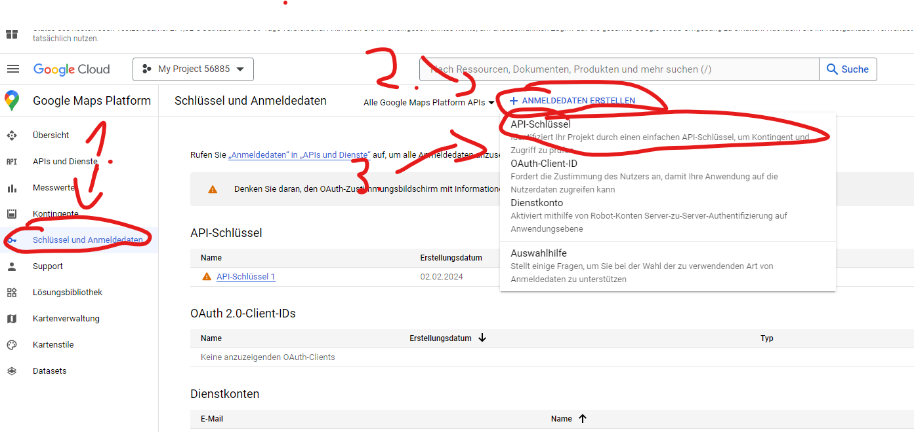
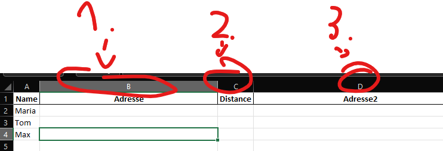

# Excel Distance Calculator
This is a Python project that calculates distances using the Google Maps API and writes them back to an Excel file.

## Getting Started

### Download
You first have to download the project. You can do this by clicking the green "Code" button at the top right and then clicking "Download ZIP". Once you have downloaded the project, extract it to a folder of your choice.


### Unzip
To unzip the project, follow these steps:
[If you really dont know how click here](https://www.youtube.com/watch?v=XAFwU2BQwHE)
### Requirements
Before you begin, ensure you have met the following requirements:

You have installed the latest version of Python. You can install it either from here: [Official Website](https://www.python.org/downloads/) (recommended) or use the Microsoft Store here: [Microsoft Store](https://www.microsoft.com/en-us/p/python-39/9p7qfqmjrfp7?activetab=pivot:overviewtab)
You have a Windows/Linux/Mac machine.

### Add the Excel File
#### Make sure your excel file starts at the first row and the first column. The first row should be headers(adress, name, etc.)
You have to move the Excel file you want to use this with into the project folder. You can do this by dragging the file into the folder.


## Installing Python
To install Python using the Official Website, follow these steps:

### Install via Official Website
Visit the official Python downloads page.
Click on the button that says "Download Python".
Once the installer is downloaded, run it. On the first installer page, make sure you check the box that says "Add Python to PATH", then click "Install Now".

### Install via Microsoft Store
To install Python using the Microsoft Store, follow these steps:
Click install.
Done.
No guarantees that the Microsoft Store version will work (Microsoft 🤷🏿‍♂️)

## Running the Project
To run this project, follow these steps:

### Locate the project directory
##### Open a terminal/command prompt. (Windows: Win+R, type "cmd", press enter. Linux/Mac: Ctrl+Alt+T)
#### REMEMBER: You can not past into a Terminal using STRG + V. You have to click the right mouse button and it will paste the text.
##### Navigate to the project directory. (Windows: cd path\to\project, Linux/Mac: cd path/to/project)
##### In my case:
```bash
cd C:\Users\user\Documents\Projects\Excel-Distance-Calc
```
#### If its in your Downloads try:
```bash
cd C:\Users\%inputyourusername%\Downloads\excel-distance-calc-main
```
Dont forget to replace %inputyourusername% with your windows username.
Here you you can find your username:


### Install the required packages
Run the following command in the terminal we opened earlier:
```bash
pip install -r requirements.txt
```

### Run the project
Run the following command in the terminal we opened earlier:
This will execute the [main.py](main.py) script.
```bash
python main.py
```

### Enter the required information
You will be asked to enter the following information:
#### Api Key: The API key for the Google Maps API. -> Key/String
To get an API key, follow these steps:
1. Visit the [Google Cloud Console.](https://console.cloud.google.com/project/_/google/maps-apis/credentials)
2. Click on "Create Project" in the top right.
3. Enter a name for your project and click "Create".
4. After some time, your project will be created. And you should get a pop-up showing your api key, copy this key and paste it into the terminal (mouse right click to paste).
5. If you dont get a pop-up, click on the "APIs & Services" in the left sidebar, then click on "Credentials". Here you can create a new API key.
#### 
6. If you got the pop up dont forget to press the button to Google Maps Platform and enable the API.
7. Also if you got the pop up, you will be asked to secure your API Key, just click later.
#### Mode: The mode of starting the journey. -> Number 1 or 2
1. = You can set the starting point to all the addresses in the table.
2. = The starting point for the will get taken from the Excel File.
#### If you choose 1:
#### Starting Point: The starting point of the journey. -> Adresse
Try copying the address from Google Maps, it will be easier.
### 
#### If you choose 2:
#### Starting Point Column: The column in which the starting points are located. -> Letter
#### Adresse Column: The column in which the addresses are located. -> Letter
#### Distance Column: The column in which the distances should be written. -> Letter
1. = Adress Column
2. = Distance Column
3. = Starting Point Column
#### 
#### File Name: The name of the Excel file. -> Name
#### 
#### Table Name: The name of the table. -> Name
You can let it empty if your Excel Table is called "Tabelle1". But only if it is called "Tabelle1". Amount of tables doesnt matter.
#### 


## Contact
If you want to contact me you can reach me at kaanhehe@users.noreply.github.com # idk if it works
#### Or if you have a problem just open a issue here on github.

## License
This project uses the following license: [LICENSE](LICENSE). -> MIT License